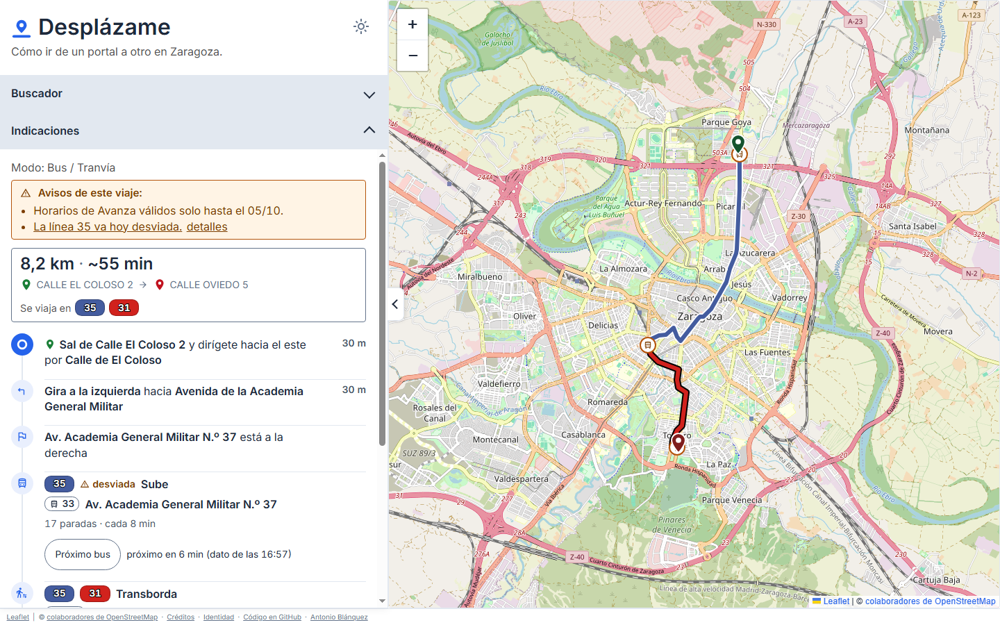
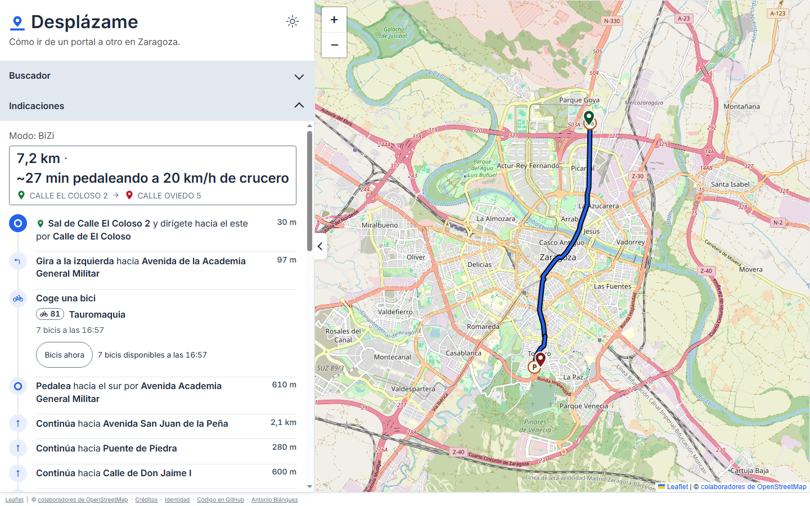
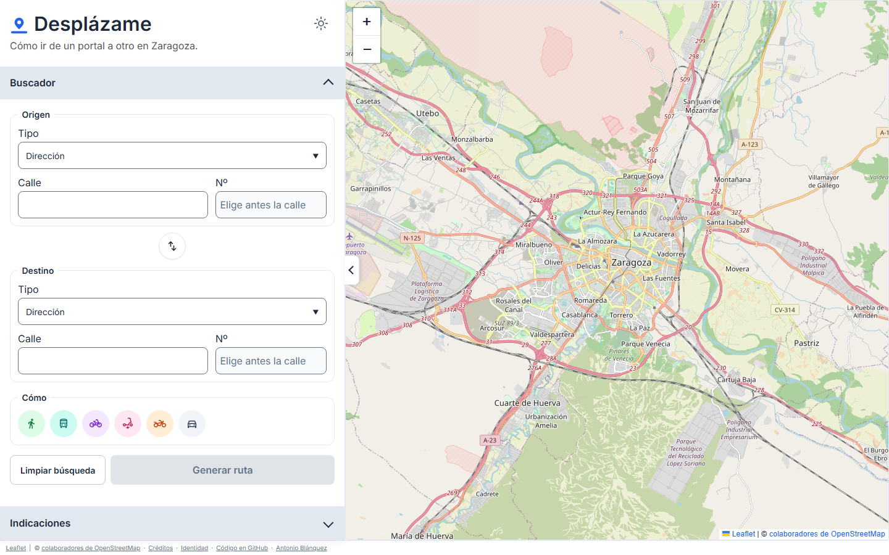
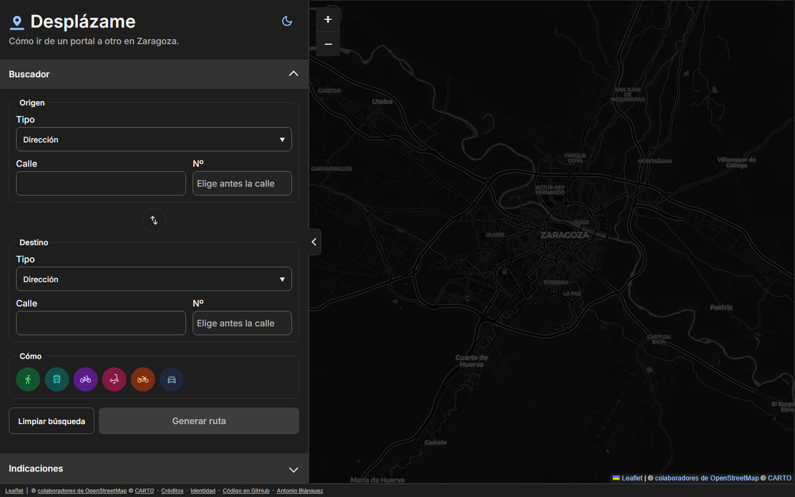
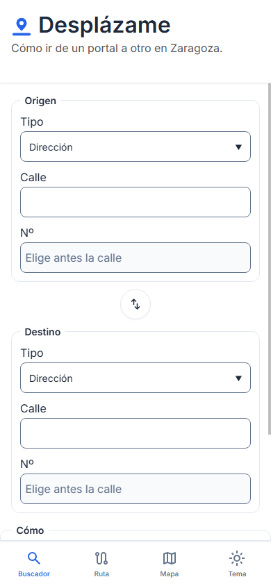
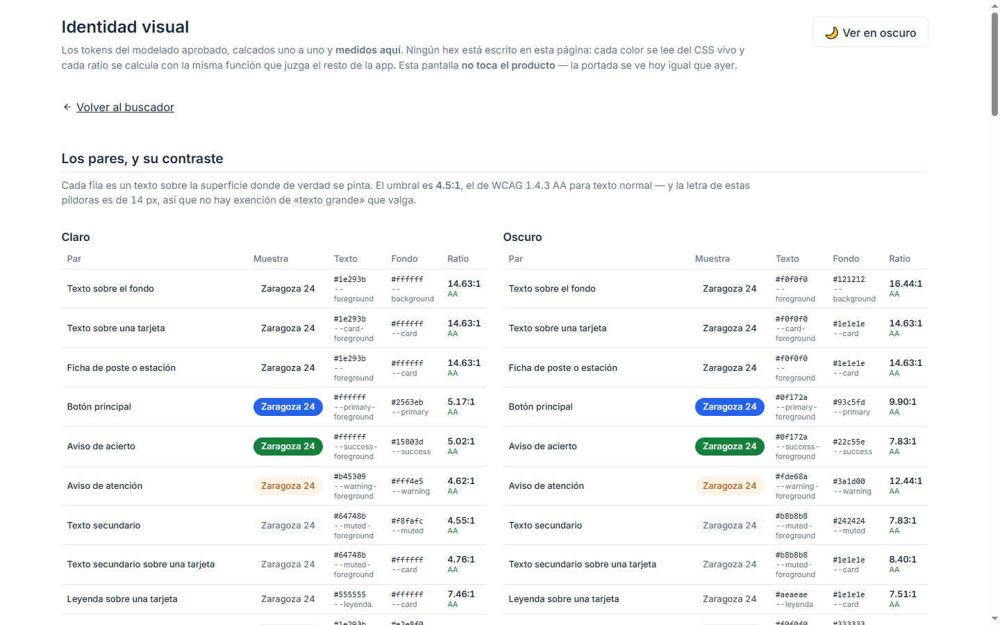

<div align="center">


# Desplázame

**Cómo ir de un portal a otro en Zaragoza: andando, en autobús o tranvía, en bici o patinete, en coche o en moto.**

[](CHANGELOG.md)
[](LICENSE)
[](https://angular.dev/)
[](https://www.typescriptlang.org/)
[](https://leafletjs.com/)
[](#hoja-de-ruta)
[](https://desplazame.antonioblanquez.es)

**8 modos · 46.150 portales · 68.649 nodos de grafo · 40 fichas de procedencia**

</div>

<div align="center">

### 📍 Verlo funcionando → **[desplazame.antonioblanquez.es](https://desplazame.antonioblanquez.es)**

</div>

> **No hay nada que instalar y no son datos de mentira: es el callejero de Zaragoza, la red de
> autobús y tranvía de hoy, y las bicis y motos que hay libres ahora mismo.** Se escribe de dónde
> a dónde, se elige el modo, y sale la ruta.
>
> 🕐 **La hora importa, y no es un fallo.** El bus se calcula con el calendario de hoy: de
> madrugada casi no hay servicio, y eso **es** la respuesta correcta. La disponibilidad de BiZi y
> de YeGo es del momento en que se pregunta, con su hora escrita al lado — y si la fuente no
> contesta, se dice.
>
> Para levantarlo en tu máquina → [**Poner en marcha**](#poner-en-marcha).

---

## Qué es

**Desplázame dice cómo ir de un portal a otro en Zaragoza.** Se escribe de dónde a dónde, se
elige el modo, y la pantalla dibuja la ruta en el mapa y lista las indicaciones paso a paso.

Son **ocho modos enteros en el motor** —andando, bus y tranvía, bici privada, patín (VMP), BiZi,
coche, moto y YeGo— que la botonera presenta en seis, porque **dos familias se preguntan en dos
pasos**: la bici («¿privada o BiZi?») y la moto («¿privada o YeGo?»).

Angular 22 con Leaflet sobre OpenStreetMap delante; Node y TypeScript **sin compilar** detrás,
con el grafo de 68.649 nodos en memoria entre peticiones. En producción desde el 8/09.

¿Prefieres verlo antes de leer nada más? Está en vivo en
**[desplazame.antonioblanquez.es](https://desplazame.antonioblanquez.es)**.

<div align="center">

<br><em>Una ruta real, ahora mismo. <strong>El aviso de que la 35 va hoy desviada no lo publica ninguna fuente como tal</strong>: sale de comparar el recorrido del GTFS con el que Avanza publica para hoy. Y el «próximo en 6 min» es el poste de verdad, no el horario.</em>
</div>

---

## Por qué existe

Desplázame nace de una pregunta que en Zaragoza nadie contestaba en un solo sitio: **¿cómo voy de
este portal a aquel otro, ahora mismo, con lo que hay?** Andando, en bus o tranvía, en BiZi, en
patinete, en coche, en moto compartida — cada modo tenía su app, su web o su cartel, y ninguno
hablaba con los demás.

Google Maps te lleva en autobús, pero **con el horario de papel**: en Zaragoza no existe GTFS en
tiempo real, así que no sabe si el bus que te pinta viene o no viene. Tampoco sabe si en la
estación de BiZi de al lado quedan bicicletas, si hay una moto de YeGo a tres calles, ni si hoy la
ZBE está en vigor y tu coche no entra.

Desplázame junta **los ocho modos en unos pocos clics** y, donde el dato del momento existe, lo
usa: la disponibilidad real de BiZi y de YeGo, lo que dice el poste del autobús, el calendario de
la ZBE. Y donde no existe, **lo dice** en vez de inventarlo — un «no lo sé» honesto vale más que
una ruta bonita y falsa. Todo con datos abiertos del Ayuntamiento y de los operadores, citados uno
a uno.

<div align="center">

<br><em><strong>«7 bicis disponibles a las 16:57»</strong> — con la hora del dato, no un número sin fecha. El botón vuelve a preguntar cuando se pulsa; nada se guarda. Si la fuente no contesta, la región lo dice en vez de quedarse en blanco.</em>
</div>

---

## Capturas

### La portada, en sus dos temas

<table>
  <tr>
    <td width="50%">
      
      <p align="center"><em>El formulario, los <strong>seis botones</strong> y el mapa. Ninguno viene marcado.</em></p>
    </td>
    <td width="50%">
      
      <p align="center"><em>En oscuro, con las teselas <strong>Dark Matter de CARTO</strong> y su atribución.</em></p>
    </td>
  </tr>
</table>

> El tema se elige con el conmutador de la cabecera —un `role="switch"` de verdad—, y el favicon
> responde al **sistema**, que es lo único que un icono de pestaña puede leer.

### El móvil, y la identidad medida

<table>
  <tr>
    <td width="38%">
      
      <p align="center"><em>A 390 px el buscador, la ruta y el mapa son <strong>pestañas</strong>, con su barra abajo.</em></p>
    </td>
    <td width="62%">
      
      <p align="center"><em><a href="https://desplazame.antonioblanquez.es/identidad">/identidad</a>: cada par de colores con su <strong>contraste calculado</strong>, no elegido a ojo.</em></p>
    </td>
  </tr>
</table>

---

## Características

**Lo que se pide**
- **Cuatro campos**: calle y portal de origen, calle y portal de destino. La calle se autocompleta
  sobre el callejero municipal; el portal, sobre los que esa calle tiene de verdad.
- **Seis familias excluyentes** —andando, bus/tranvía, bici, patín (VMP), moto y coche— y **ocho
  modos** detrás, porque la bici y la moto se preguntan en dos pasos. Son un grupo de radios
  vestido de botones: con radios el teclado sale de serie.
- **Tres clases de ruta** —Rápida, Equilibrada y Tranquila— **solo** para la bici y la BiZi: el
  patín no elige por ley y los demás no tienen nada que calibrar.
- Y las preguntas que cada modo necesita: dónde aparcar y qué distintivo ambiental en coche, el
  distintivo también en moto privada.

**Lo que sale**
- **La ruta en el mapa** y **las indicaciones paso a paso** debajo.
- **Hitos** cuando el viaje cambia de vehículo: dónde se sube, dónde se transborda y dónde se baja
  del autobús; dónde se coge y se deja la bici; dónde se aparca.
- **El minuto de verdad para el primer autobús**, preguntado al poste — y de los demás, a petición
  con un botón. Solo el primero por defecto: «próximo en 3 min» en un poste al que se llega dentro
  de cuarenta minutos es un número cierto sobre un autobús que no se va a coger.
- **Avisos cuando hace falta**: que la línea va hoy desviada y por dónde no para, que no hay
  aparcabicis cerca y a cuántos metros estaba el más próximo, que el pedaleo supera el tramo
  incluido del abono, que la ZBE veta la entrada a ese vehículo.

**Y no solo a un portal**: también a un sitio —una farmacia, un centro de salud, una biblioteca, un
colegio— eligiendo el tipo en vez de la calle. Cómo se resuelve cada uno, en
[**`docs/SITIOS.md`**](docs/SITIOS.md).

**Lo que Desplázame no hace**
- **No adivina.** Si un dato no está, dice que no está — nunca un valor por defecto que parezca
  medido.
- **No confunde «no hay» con «no lo sé».** Son dos frases distintas en pantalla, a propósito.
- **No pide nada.** Sin cuentas, sin registro, sin cookies propias, sin analítica.

**Accesibilidad, y medida**
- Ningún estado se comunica **solo con el color**: siempre hay forma o palabra.
- Contraste, zonas táctiles y foco **verificados sobre la pantalla pintada**, no sobre el CSS
  declarado — y con la vara de la casa en **44 px**, que es AAA, con acta por cada excepción.
- Los avisos que aparecen solos van en `role="status"`, y la región **ya está en el DOM antes** de
  tener nada dentro: es lo único que hace que un lector de pantalla los anuncie.

---

## Las fuentes, y qué se hace con cada una

| Fuente | Qué aporta | Qué **no** |
|---|---|---|
| **Callejero y portales** (IDEZar) | Las 3.359 vías y los **46.150 portales** con su coordenada | No trae los portales que el callejero no numera |
| **OpenStreetMap** | La cartografía, el grafo peatonal y ciclable, el viario del coche con sus giros vetados y sus velocidades | La ordenanza municipal no está en OSM: se cita aparte |
| **GTFS del Punto de Acceso Nacional** | La red de bus y tranvía: 984 paradas, 170 patrones, 89 trazados | **No hay tiempo real en Zaragoza.** Y el calendario no refleja las obras |
| **Web de Avanza** (ruta operativa) | Por dónde pasa **hoy** cada línea, con el desvío ya aplicado | No dice que sea un desvío: hay que **derivarlo** |
| **Poste de Avanza** (llegadas) | Los minutos que faltan de verdad en un poste | No detecta el autobús que **pasa pero no para** |
| **Sede del Ayuntamiento** (BiZi en vivo) | Bicis y anclajes libres, ahora | Su hora es la del dato, no la de la consulta |
| **GBFS de YeGo** | Las motos compartidas libres y su autonomía | ⚠️ **No declara licencia**: ni `license_id` ni `license_url` |
| **ZBE, aparcamientos y zonas reguladas** (IDEZar) | Dónde no se puede entrar, dónde se puede aparcar y a qué hora | La autorización de entrada es un trámite, no un dato |

**Ninguna fuente se copia a ciegas.** Las que caducan —BiZi, YeGo, el poste, la ruta operativa— se
**consultan** en tiempo de ejecución; las que no, entran como **semilla fechada** en el
repositorio, con su `sha256` y su fecha en la ficha.

⚖️ Cada conjunto tiene **una ficha propia** con su titular, su licencia, su fecha de descarga y
**lo que trae de roto**: [**`THIRD-PARTY-NOTICES.md`**](THIRD-PARTY-NOTICES.md).

📊 Y la frescura se mira **desde dentro de la aplicación**: hay un panel que lee el manifiesto de
datos y dice qué hay, de cuándo es y si ha caducado —
[**`docs/PANEL-DE-FRESCURA.md`**](docs/PANEL-DE-FRESCURA.md).

---

## Stack tecnológico

| Capa | Tecnología |
|---|---|
| **Interfaz** | [Angular 22](https://angular.dev/) con componentes *standalone* (sin NgModules) · *build* con Angular CLI |
| **Mapa** | [Leaflet](https://leafletjs.com/) sobre [OpenStreetMap](https://www.openstreetmap.org/) |
| **Motor** | **Node** + **TypeScript** ejecutado **sin compilar** —Node borra los tipos al ejecutar, así que no hay *build*— · servidor mínimo (`node:http`) |
| **Tipos compartidos** | Un paquete común al motor y a la interfaz (`@desplazame/tipos`), también sin *build*. **El contrato crece cuando el motor lo pide**, no antes: si el motor cambia la forma de la respuesta, la interfaz no compila. **Eso es a propósito** |
| **Pruebas** | [Vitest](https://vitest.dev/) (interfaz) + `node:test` (motor) + diez suites de pantalla que conducen **Chrome de verdad por CDP**, sin dependencias |
| **Despliegue** | Hostinger, plan Node |

### Sin base de datos, y sin dependencias en el arnés

*No es una carencia.* El grafo de **68.649 nodos** se carga una vez al arrancar y vive en memoria
entre peticiones — eso lo impone el dato, no el gusto. Y el instrumento que mide la pantalla no
trae Playwright ni Puppeteer: habla CDP directamente, porque **una dependencia menos es una cosa
menos que puede envejecer**.

```
app/         la interfaz Angular. `marca/` los SVG del logo; `e2e/` las diez suites de pantalla.
motor/       el servidor: rutas, grafo, GTFS, fuentes vivas. TypeScript sin compilar.
tipos/       el contrato entre los dos. Sin build.
scripts/     la batería de pantalla y el rasterizador de la marca.
docs/        la bitácora, el despliegue, la auditoría de cierre y la crónica.
```

---

## Poner en marcha

Hace falta **[Node](https://nodejs.org/)** y nada más. **Probado con Node 24.19.0 y npm 11.17.0**;
el repositorio declara `engines: { node: ">=22" }`. El motor **ejecuta TypeScript sin compilarlo**,
y eso pide un Node reciente: con uno viejo no arranca.

```bash
git clone https://github.com/ablanquez/desplazame.git
cd desplazame
npm install          # en la RAÍZ: son workspaces, instala los tres a la vez
```

> ℹ️ **`npm install` imprime avisos `allow-scripts` de esbuild y otros: es lo esperado y no
> bloquea nada.** Salen cuatro paquetes con `postinstall` sin ejecutar —`esbuild`, `lmdb`,
> `@parcel/watcher`, `msgpackr-extract`— y la orden sale con **0**. Se dice porque cuatro líneas
> en amarillo sin nada escrito al lado son media hora de alguien comprobando si tiene un problema.

> ⭐ **Y no hace falta ninguna clave para arrancar.** El GTFS entra en el repositorio como
> **semilla fechada**, así que un clon limpio levanta el bus y el tranvía sin pedirle nada a nadie.
> Las dos variables de `motor/.env.local` **solo hacen falta para renovarlo**.

Y luego **dos terminales**, porque son dos procesos:

```bash
# terminal 1 — el motor, en el 3000
cd motor && npm start

# terminal 2 — la interfaz, en el 4200
cd app && npm start
```

Con las dos arriba: **<http://localhost:4200/>** el buscador · **`/identidad`** la identidad
visual · **`/creditos`** las fuentes con su licencia · **`/panel`** el panel de frescura (intranet:
**no viaja a producción**, y hay una prueba que lo vigila).

### Las pruebas

Son tres órdenes y **una va primero**:

```bash
npm run build --workspace @desplazame/motor   # PRIMERO: emite motor/dist (tsc, ~2 s)
npm run probar                                # motor (node:test) + interfaz (Vitest)
npm run comprobar-tipos                       # los dos lados, con censo de ficheros
```

**Por qué el build va antes.** Una jueza del motor comprueba el puente de arranque de producción
(`motor/arranque.cjs`), que carga `motor/dist/servidor.js` — y ese `dist` **no viaja en el
repositorio**. Sin construirlo, esa jueza **se salta diciendo por qué**, con el comando dentro del
mensaje. Un *skip* que nombra su paso es información; el rojo que salía antes era ruido.

**Y las de pantalla no entran ahí**: son diez suites que conducen un Chrome de verdad y necesitan
la aplicación sirviendo. Van por su propia entrada, con el motor y la interfaz arriba:

```bash
npm run bateria                 # las diez, en orden
npm run bateria -- pintura      # solo una
```

> ⚠️ **El defecto es `localhost` y no `127.0.0.1`, y está medido:** `ng serve` **solo se ata al
> loopback de IPv6** (`TCP [::1]:4200`), así que `127.0.0.1:4200` no lo coge nadie. Contra un
> `dist` servido por otro proceso sí conviene fijar `--url=http://127.0.0.1:PUERTO`, para no medir
> un `ng serve` olvidado.

El detalle largo —el porqué de cada paso, las guardias de arranque, la geolocalización, el mapa
sin JS— está en [**`docs/ARRANQUE-LOCAL.md`**](docs/ARRANQUE-LOCAL.md).

---

## Cómo está construido

Cinco cosas que no se ven en las capturas y explican el resto:

**1 · Lo que se descubre se escribe, aunque duela.** Hay una
[**bitácora**](docs/BITACORA.md) de fallos reales que guarda **el dato que caduca**: qué daba
verde mientras el fallo estaba vivo. No es un registro de arreglos: es el registro de lo que
mintió, con la ley que salió de cada uno.

**2 · Las pruebas miran la pantalla, no el código.** Las de unidad son más de **1.400** entre
motor e interfaz; las diez suites de pantalla suman **más de mil setecientos veredictos** y miden
el píxel pintado, el contraste real y el foco con el teclado — no la clase de CSS que debería
haberlo hecho.

**3 · La fase de cierre fue una auditoría de verdad.** Seis bloques —código, tests, interfaz,
operación, experiencia, documentación—, **38 hallazgos** dictados uno a uno, cuatro tandas de
arreglo, y una **séptima pieza** en la que el auditor volvió a verificar sus propios informes: 56
piezas, y tres discrepancias encontradas en cifras propias. Todo en
[**`docs/auditoriafinal/`**](docs/auditoriafinal/).

**4 · Y se verificó desde fuera.** Ya desplegada, con Lighthouse, axe-core, SSL Labs y el
validador del W3C — y con la regla de que **lo que la nota esconde vale más que la nota**: la
categoría de accesibilidad marcaba 100 y debajo había cinco hallazgos reales, que se cerraron uno
a uno. El registro, en
[**`docs/auditoriafinal/EXTERNA.md`**](docs/auditoriafinal/EXTERNA.md) y su
[anexo de la sesión de mano](docs/auditoriafinal/EXTERNA-ANEXO-2026-09-28.md).

**5 · El push ES el despliegue, salvo cuando no lo es.** Hostinger redespliega desde `main`, pero
el 26/09 se midió que **el webhook puede no disparar** y hay que darle al botón. Eso y todo lo
demás —qué viaja, qué no, dónde viven las variables y lo que quedó por saber— en
[**`docs/DESPLIEGUE.md`**](docs/DESPLIEGUE.md).

**Lo que no cabe aquí vive al lado**, y es donde está lo interesante:

- **[`CHANGELOG.md`](CHANGELOG.md)** — qué trae cada versión publicada, en formato Keep a
  Changelog.
- **[`PLAN-DESPLAZAME.md`](PLAN-DESPLAZAME.md)** — el plan por puntos: qué está hecho, qué toca
  ahora y qué queda.
- **[`docs/CRONICA-DE-CONSTRUCCION.md`](docs/CRONICA-DE-CONSTRUCCION.md)** — **la sección «Estado»
  que este README tuvo durante semanas**, tal cual, con sus fechas y sus «Aquí ponía». Registro
  fechado: no se reescribe.
- **[`docs/BITACORA.md`](docs/BITACORA.md)** — los fallos reales, con lo que daba verde mientras
  el fallo estaba vivo y la ley que salió de cada uno.
- **[`docs/ARRANQUE-LOCAL.md`](docs/ARRANQUE-LOCAL.md)** — arrancarlo en local, con el porqué de
  cada paso.
- **[`docs/SITIOS.md`](docs/SITIOS.md)** — ir a un sitio y no solo a un portal: farmacias, centros
  de salud, bibliotecas, colegios.
- **[`docs/PANEL-DE-FRESCURA.md`](docs/PANEL-DE-FRESCURA.md)** — el panel de frescura y el
  manifiesto de datos que lo sostiene.
- **[`docs/DESPLIEGUE.md`](docs/DESPLIEGUE.md)** — cómo esto llega a producción, medido por SSH, y
  lo que sigue sin constar.
- **[`docs/auditoriafinal/EXTERNA.md`](docs/auditoriafinal/EXTERNA.md)** — la verificación
  externa, con sus informes guardados al lado.
- **[`docs/INVESTIGACION-EQUIPAMIENTOS.md`](docs/INVESTIGACION-EQUIPAMIENTOS.md)** — los datos
  abiertos del Ayuntamiento sondeados uno a uno.
- **[`THIRD-PARTY-NOTICES.md`](THIRD-PARTY-NOTICES.md)** — una ficha por conjunto de datos: de
  dónde salió, con qué licencia, y qué trae de roto.

---

## Hoja de ruta

✅ **Hoy:** los ocho modos de punta a punta, con sus hitos y sus avisos; la disponibilidad viva de
BiZi y de YeGo; el minuto real del poste; la ZBE con su calendario y su distintivo; el destino por
tipo de sitio; el panel de frescura; la identidad medida — y **en marcha en
[desplazame.antonioblanquez.es](https://desplazame.antonioblanquez.es)**. Todo lo que incluye esta
primera versión está en el [**CHANGELOG**](CHANGELOG.md).

**Lo que queda declarado, sin fechas ni promesas** — sale de la cola con nombre del estado del
proyecto y de la mesa de decisiones de la auditoría:

- **Las sesiones de mano**: un lector de pantalla de verdad (NVDA) y un teléfono físico. Lo que un
  escáner no ve solo se sabe usándolo.
- **Dos guardianes que faltan y están dichos**: la rama de `/api/poste-vivo` sin jueza de pantalla,
  y la propia batería, que no tiene quien la juzgue a ella.
- **Las cabeceras de seguridad** —HSTS, `X-Frame-Options`, `X-Content-Type-Options`,
  `Referrer-Policy`, `Permissions-Policy`—: no salen del código, las pone el hosting. Tarea de
  panel.
- **El webhook del despliegue, que no dispara**, hasta entender por qué.
- **El tope de tamaño de los perfiles del arnés**, hoy sin vigilar a largo plazo.

⛔ Y una que **no se va a poder cerrar desde fuera**, y se dice: la regla por la que el CDN sirve
la página a unos y pone un desafío a otros. Sin el panel del CDN, `NO CONSTA`.

---

## Licencia y créditos

Código: **[Apache 2.0](LICENSE)** · © 2026 **Antonio Blánquez Cabeza** —
[antonioblanquez.es](https://antonioblanquez.es)

Las dependencias de terceros conservan sus propias condiciones, una por una, en
**[`THIRD-PARTY-NOTICES.md`](THIRD-PARTY-NOTICES.md)**.

**Los datos no van bajo esa licencia**: conservan las suyas, y son tres regímenes distintos —la
**ODbL 1.0** de OpenStreetMap, con su atribución literal a «© **colaboradores** de
OpenStreetMap»; la **[Ley 37/2007](https://www.boe.es/eli/es/l/2007/11/16/37/con)** para el dato
municipal, que obliga a citar fuente y fecha; y **`NO CONSTA`** para el feed de YeGo, que no
declara ninguna. Cada uno con su ficha, su fecha y su obligación en el notices.

> ℹ️ El notices lleva **una ficha por conjunto, y hoy son 40**
> (`grep -c '^### 1\.' THIRD-PARTY-NOTICES.md`), con su
> [índice al principio](THIRD-PARTY-NOTICES.md#índice-de-las-fichas-de-datos).
>
> ⚠️ **Este párrafo ha ido diciendo «quince», «veinticuatro», «veintiséis», «veintisiete»,
> «treinta y uno», «treinta y tres», «treinta y cuatro», «treinta y cinco», «treinta y seis»,
> «treinta y siete», «treinta y ocho», «treinta y nueve» y ahora cuarenta**, y las tres primeras
> se quedaron viejas donde estaban. Es la entrada nº5 de la bitácora repitiéndose: una regla de
> releída vale lo que su alcance. **Desde el 1/09 ya no depende de que alguien relea**:
> `app/src/app/atribucion.spec.ts` cuenta las fichas del notices y las compara con el número que
> dice esta línea — la de dígitos **y la de letra**. Si no cuadran, la suite se pone roja.

⭐ **Dos fuentes se atribuyen aunque su licencia no lo pida**, por decisión de Antonio del
01/09/2026: *«Llegadas y recorrido operativo: Avanza Zaragoza S.A.U.»* en el pie de la pantalla, y
la flota viva de YeGo. Ninguna de las dos contempla la atribución; se atribuye igual, y el porqué
está en **§ 1.24** y **§ 1.34** del notices.

Cartografía © [colaboradores de OpenStreetMap](https://www.openstreetmap.org/copyright) ·
teselas oscuras © [CARTO](https://carto.com/attributions) · datos de transporte procesados a
partir del GTFS del Punto de Acceso Nacional. **Powered by
[MITRAMS](https://www.transportes.gob.es/).**

**No es un producto oficial del Ayuntamiento de Zaragoza, de Avanza Zaragoza ni de YeGo.**
